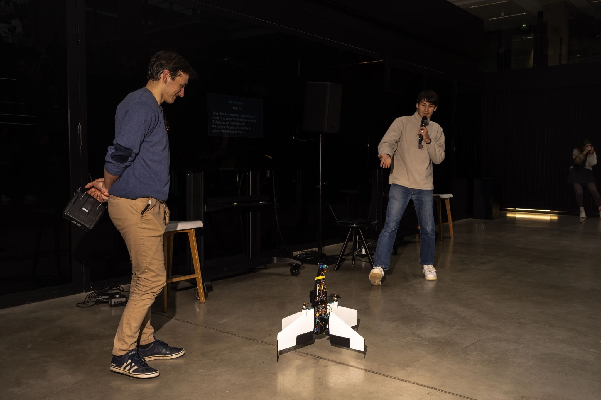

Here are few samples from the defense hackathon EDTH Paris.
CAD parts of the drone are available as well as a lua script with PI controller on attitude and UART communication to companion computer

****************
Image: Presentation of the prototype after a demo fly

  

*Inside story: My collarbone was still broken from a cycling accident but i still went to the hackathon*
